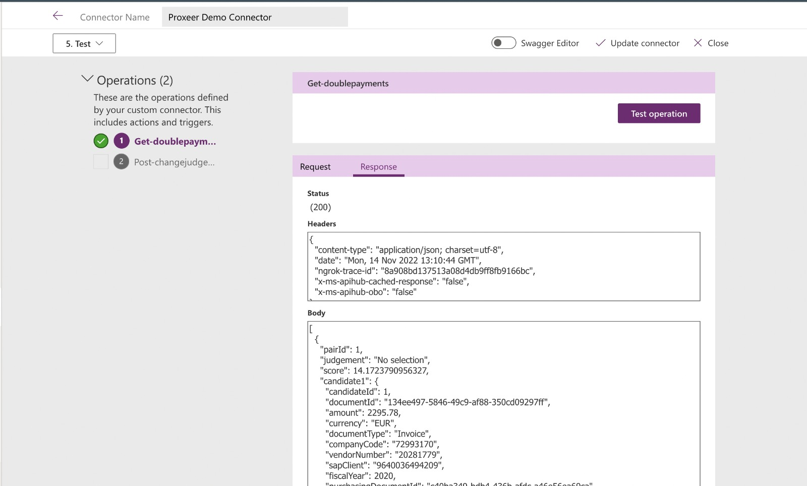

# Custom API Connector

Here you can find the instruction for creating a custom api connector in PowerApps:

1. Go to PowerApps -> Dataverse -> Custom Connectors
2. Add new custom connector -> Import an OpenAPI file
3. Give a name, like Proxeer Demo Connector (30 chars max!)
4. Select OpenAPI file from computer -> like Proxeer-Demo-Connector.swagger.json in this dir
5. Make changes you want, like adding request ids to the request (needed for validation)
6. Save connector
7. Edit connector and in `5. Test` create a new connection with the API key of the app
8. Test operation

(you might need to change the host url to the one you are using, f.e. via ngrok)

